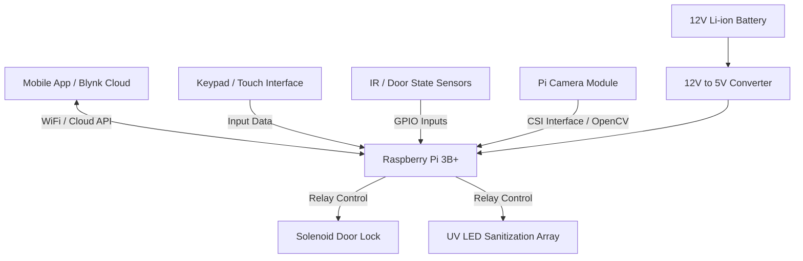
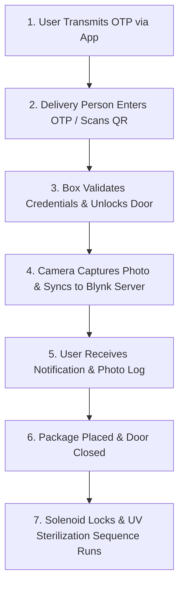
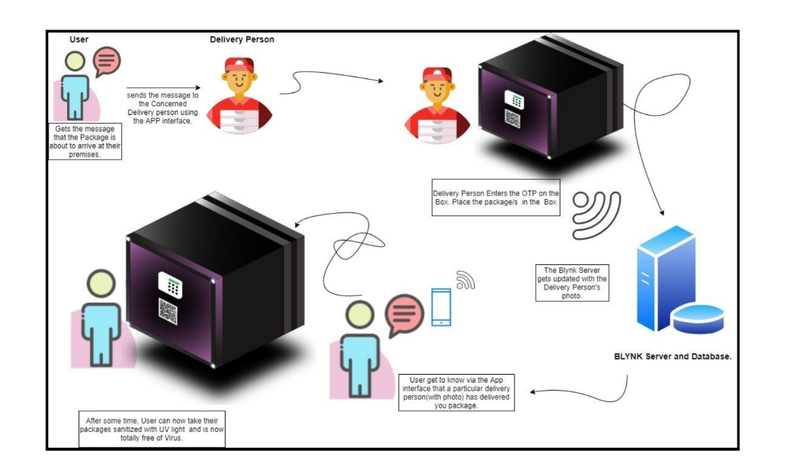
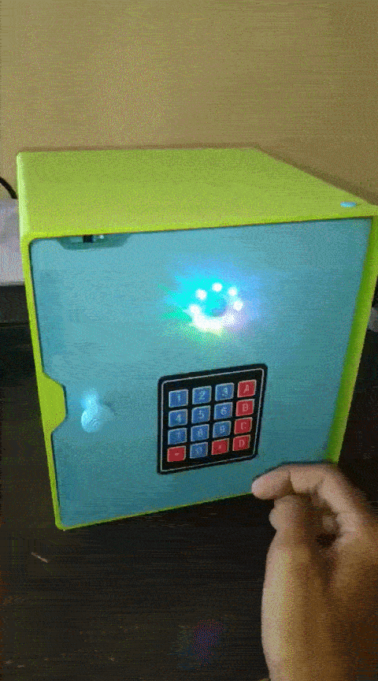

# Delivery BOX-er: Smart IoT Contactless Delivery & Disinfection Safe

An intelligent, secure IoT delivery locker designed for automated contactless package receipt, OTP/QR-based authentication, anti-theft security, and UV-C surface sterilization.

---

## 📌 Project Overview

**Delivery BOX-er** addresses the challenge of secure, contactless package delivery. The system acts as a smart physical gateway at a user's doorstep, enabling delivery personnel to deposit packages securely using one-time passwords (OTP) or dynamic QR codes without requiring direct physical human contact.

### Key Features
* **Multi-Factor Authentication:** Keypad OTP entry and app-generated dynamic QR code scanning for authorized unlocking.
* **Automated Security Audit:** Integrated Pi Camera captures delivery personnel imagery during drop-off and syncs records to the cloud database.
* **Active UV Disinfection:** Automated relay-driven UV LED sterilization sequence inside the enclosure upon door closure[cite: 10, 11].
* **IoT Mobile Interface:** Real-time mobile notifications, remote door actuation, and delivery tracking via Blynk IoT platform[cite: 10, 11].
* **Anti-Theft Security:** Sensor-driven door state monitoring and tamper alarm trigger logic.

---

## 🛠️ System Architecture & Hardware Setup

### 🛠️ Hardware Components
* **Core Controller:** Raspberry Pi 3B+ running Linux OS & custom Python control scripts.
* **Visual Verification:** Pi Camera Module (OpenCV-enabled capture).
* **Actuation Subsystem:** 2-Channel Relay Board controlling 12V Electronic Door Lock and UV LED Array.
* **User Input & Sensors:** Keypad matrix / UI interface and IR door detection sensors.
* **Power Management:** 12V Li-ion battery pack coupled with a high-efficiency 12V-to-5V DC-DC converter.
* **Physical Enclosure:** Custom CAD-designed enclosure modeled in Autodesk Fusion 360.

---

## 📐 Operational Workflow

### 💻 Tech Stack & Tools
* **Embedded Programming:** Python 3, GPIO control, Linux OS environment.
* **Computer Vision & Cloud:** OpenCV (Image capture/processing), Blynk IoT Server & API.
* **CAD & Enclosure Design:** Autodesk Fusion 360, 3D printing, sheet metal enclosure layouts.
* **Power & Electronics Design:** Relay switching, DC-DC buck regulation, 12V Li-ion power routing.

## 📷 Media & Prototypes

| Process Flowchart | Working Prototype |
| :---: | :---: |
|  |  |

---

## 👥 Project Team & Credits

* **Brandon Saldanha**
* **Dinesh Parmar**
* **Shubham Suryavanshi**
* **Siddhi Kulkarni**

**Degree:** Bachelor of Engineering (B.E.) in Electronics Engineering

---

## 📜 License

Distributed under the **MIT License**. See `LICENSE` for more information.
